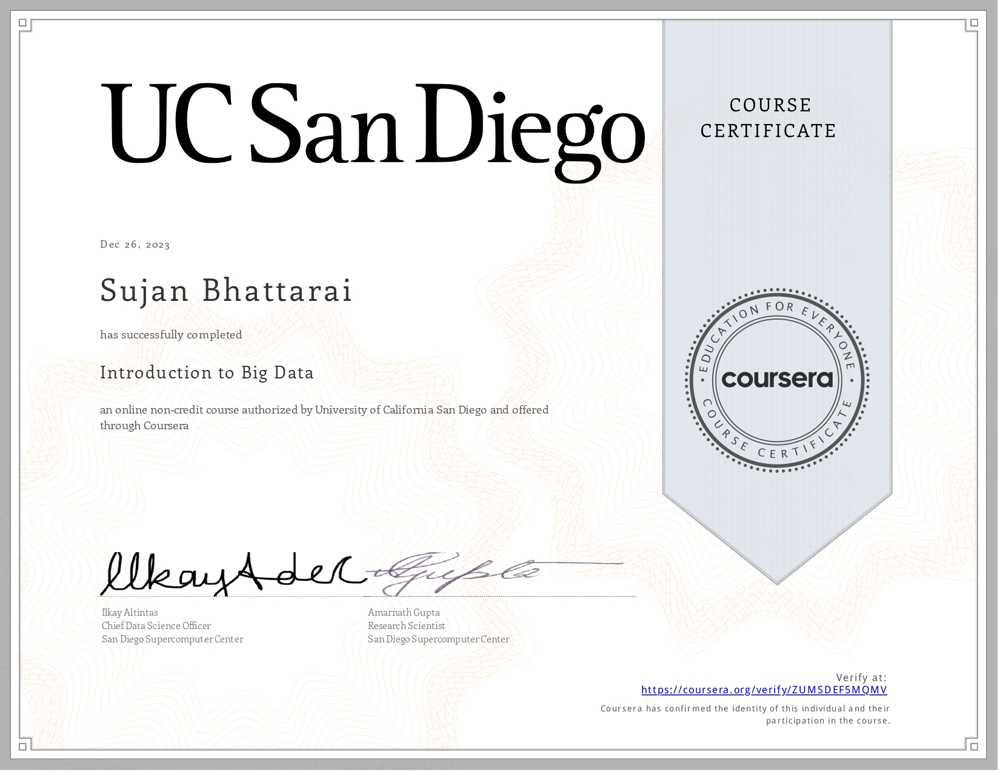
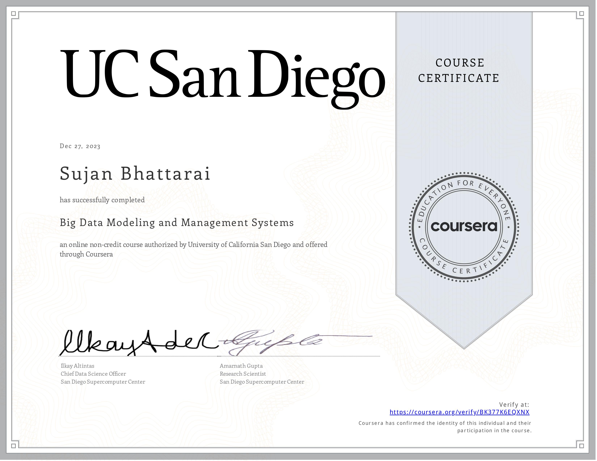
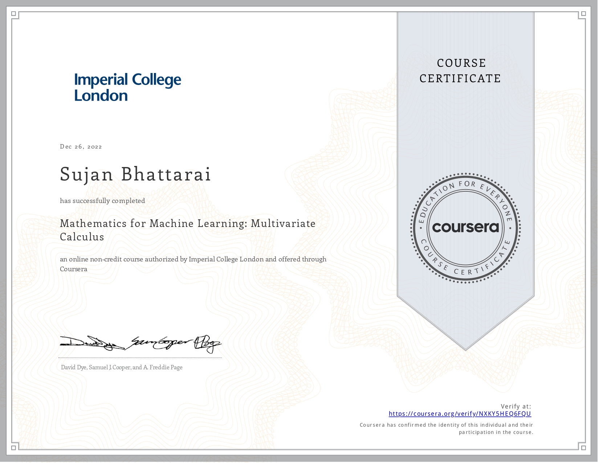
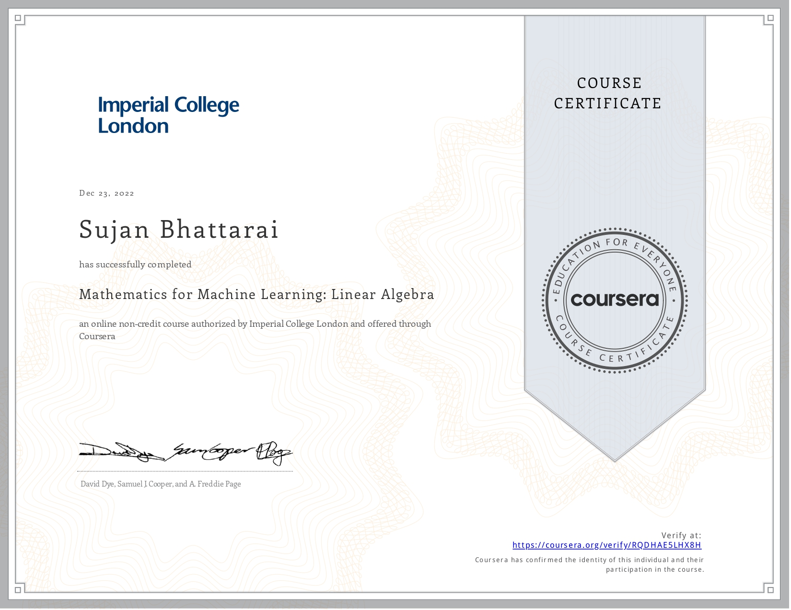

```{r, out.width = "100%", out.height="100%", fig.align = "center", echo = F}
#use knit to add the pdf
knitr::include_graphics("files/certificates/data_scientist_with_r.jpg")
```

```{r, echo = F}
#use knit to add the pdf

```

```{r, echo = F}
#use knit to add the pdf

```
```{r, echo = F}
#use knit to add the pdf

```

```{r echo = F}
#use knit to add the pdf

```


