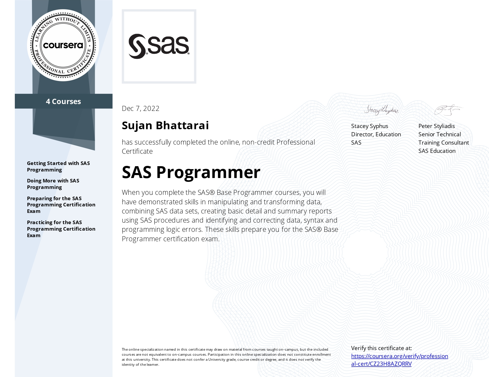
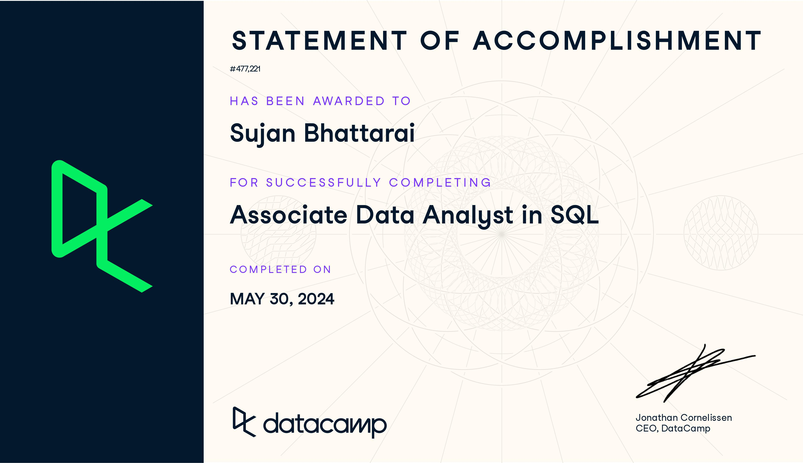

```{=html}
<!-- <hr style="height: 3px; border: none; background-color: white; font-weight: bold;"> -->

<!-- <div style="display: flex; align-items: center; justify-content: space-between; margin-top: 20px;"> -->
<!--   <div style="position: relative;"> -->
<!--     <hr style="position: absolute; top: 0; left: 0; width: 3px; height: 100%; background-color: darkgrey; border: none; margin: 0;"> -->
<!--   </div> -->
<!--   <div style="flex: 1;"> -->
<!--     <h3> Data Science with R </h3> -->
<!--     <div style="background-color: #213343; font-size: 16px; border: none; border-left: 3px solid darkgrey; padding: 10px; margin-top: 10px; border-radius: 10px;"> -->
<!--       <ul style="list-style-type: none; padding: 0; margin: 0;"> -->
<!--         <li>Fundamentals of R programming</li> -->
<!--         <li>Data manipulation with dplyr and tidyr</li> -->
<!--         <li>Data visualization using ggplot2</li> -->
<!--         <li>Statistical analysis and hypothesis testing</li> -->
<!--         <li>Machine learning with R</li> -->
<!--       </ul> -->
<!--     </div> -->
<!--   </div> -->
<!--   <div style="flex: 1; text-align: right;"> -->
<!--      -->
<!--   </div> -->
<!-- </div> -->


<!-- <div style="display: flex; align-items: center; justify-content: space-between; margin-top: 20px;"> -->
<!--   <div style="position: relative;"> -->
<!--     <hr style="position: absolute; top: 0; left: 0; width: 3px; height: 100%; background-color: darkgrey; border: none; margin: 0;"> -->
<!--   </div> -->
<!--   <div style="flex: 1;"> -->
<!--     <h3> SAS programming </h3> -->
<!--     <div style="background-color: #213343; font-size: 16px; border: none; border-left: 3px solid darkgrey; padding: 10px; margin-top: 10px; border-radius: 10px;"> -->
<!--       <ul style="list-style-type: none; padding: 0; margin: 0;"> -->
<!--         <li>SAS function, tables, Schemas</li> -->
<!--         <li>Data cleaning and analysis with SAS</li> -->
<!--         <li>Statistical analysis with SAS procedures</li> -->
<!--         <li>Creation of reports and graphics</li> -->
<!--       </ul> -->
<!--     </div> -->
<!--   </div> -->
<!--   <div style="flex: 1; text-align: right;"> -->
<!--      -->
<!--   </div> -->
<!-- </div> -->


<!-- <div style="display: flex; align-items: center; justify-content: space-between; margin-top: 20px;"> -->
<!--   <div style="position: relative;"> -->
<!--     <hr style="position: absolute; top: 0; left: 0; width: 3px; height: 100%; background-color: darkgrey; border: none; margin: 0;"> -->
<!--   </div> -->
<!--   <div style="flex: 1;"> -->
<!--     <h3> Concepts on Big data </h3> -->
<!--     <div style="background-color: #213343; font-size: 16px; border: none; border-left: 3px solid darkgrey; padding: 10px; margin-top: 10px; border-radius: 10px;"> -->
<!--       <ul style="list-style-type: none; padding: 0; margin: 0;"> -->
<!--         <li>Conceptual understanding of Big Data</li> -->
<!--         <li>Big Data technologies and ecosystems</li> -->
<!--         <li>Data processing and storage techniques</li> -->
<!--         <li>Big Data analytics and applications</li> -->
<!--       </ul> -->
<!--     </div> -->
<!--   </div> -->
<!--   <div style="flex: 1; text-align: right;"> -->
<!--      -->
<!--   </div> -->
<!-- </div> -->


<!-- <div style="display: flex; align-items: center; justify-content: space-between; margin-top: 20px;"> -->
<!--   <div style="position: relative;"> -->
<!--     <hr style="position: absolute; top: 0; left: 0; width: 3px; height: 100%; background-color: darkgrey; border: none; margin: 0;"> -->
<!--   </div> -->
<!--   <div style="flex: 1;"> -->
<!--     <h3> Big Data Modelling</h3> -->
<!--     <div style="background-color: #213343; font-size: 16px; border: none; border-left: 3px solid darkgrey; padding: 10px; margin-top: 10px; border-radius: 10px;"> -->
<!--       <ul style="list-style-type: none; padding: 0; margin: 0;"> -->
<!--         <li>Understanding of Big Data modeling techniques</li> -->
<!--         <li>Application of predictive analytics in Big Data</li> -->
<!--         <li>Hands-on experience with Hadoop</li> -->
<!--         <li>Designing and implementing Big Data solutions</li> -->
<!--       </ul> -->
<!--     </div> -->
<!--   </div> -->
<!--   <div style="flex: 1; text-align: right;"> -->
<!--      -->
<!--   </div> -->
<!-- </div> -->

<!-- <div style="display: flex; align-items: center; justify-content: space-between; margin-top: 20px;"> -->
<!--   <div style="position: relative;"> -->
<!--     <hr style="position: absolute; top: 0; left: 0; width: 3px; height: 100%; background-color: darkgrey; border: none; margin: 0;"> -->
<!--   </div> -->
<!--   <div style="flex: 1;"> -->
<!--     <h3> Data Analyst with SQL </h3> -->
<!--     <div style="background-color: #213343; font-size: 16px; border: none; border-left: 3px solid darkgrey; padding: 10px; margin-top: 10px; border-radius: 10px;"> -->
<!--       <ul style="list-style-type: none; padding: 0; margin: 0;"> -->
<!--         <li>Basic SQL syntax and queries</li> -->
<!--         <li>Data manipulation with SQL</li> -->
<!--         <li>Joining and aggregating data</li> -->
<!--         <li>Writing subqueries and complex queries</li> -->
<!--       </ul> -->
<!--     </div> -->
<!--   </div> -->

<!--   <div style="flex: 1; text-align: right;"> -->
<!--      -->
<!--   </div> -->
<!-- </div> -->

```


```{=html}
<!DOCTYPE html>
<html lang="en">
<head>
    <meta charset="UTF-8">
    <meta name="viewport" content="width=device-width, initial-scale=1.0">
    <title>Certificate Page</title>
    <style>
        /* Container Styling */
        .certificate-container {
            display: flex;
            align-items: center;
            justify-content: space-between;
            margin-top: 20px;
            background-color: white; /* Light gray background */
            padding: 20px;
            border-radius: 10px;
            box-shadow: 0 2px 4px rgba(0, 0, 0, 0.1); /* Subtle shadow */
            position: relative;
        }

        /* Image Styling */
        .certificate-image {
            width: 400px;
            border-radius: 8px; /* Rounded corners */
            transition: transform 0.3s ease; /* Smooth transition on hover */
        }
        .certificate-image:hover {
            transform: scale(1.35); /* Enlarge image on hover */
        }
        /* Content Styling */
        .certificate-details {
            flex: 1;
            margin-left: 20px;
        }
        .certificate-details h3 {
            margin-top: 0;
            font-size: 24px;
            color: #333; /* Dark text color */
        }
        .certificate-details ul {
            list-style-type: none;
            padding: 0;
            margin: 0;
        }
        .certificate-details li {
            margin-bottom: 5px;
            color: #555 !important; /* Medium dark text color */
        }
        ul,
        ul li {
            color: #000; /* Black text color */
        }
    </style>
</head>
<body>
    <!-- Certificate Sections -->
    <div class="certificate-container">
        <div class="certificate-details">
            <h3>Data Science with R</h3>
            <ul>
                <li>Fundamentals of R programming</li>
                <li>Data manipulation with dplyr and tidyr</li>
                <li>Data visualization using ggplot2</li>
                <li>Statistical analysis and hypothesis testing</li>
                <li>Machine learning with R</li>
            </ul>
        </div>
        <div>
            
        </div>
    </div>

    <!-- Certificate Sections -->
    <div class="certificate-container">
        <div class="certificate-details">
            <h3>SAS programming</h3>
            <ul>
                <li>SAS function, tables, Schemas</li>
                <li>Data cleaning and analysis with SAS</li>
                <li>Statistical analysis with SAS procedures</li>
                <li>Creation of reports and graphics</li>
            </ul>
        </div>
        <div>
            
        </div>
    </div>

    <!-- Certificate Sections -->
    <div class="certificate-container">
        <div class="certificate-details">
            <h3>Concepts on Big data</h3>
            <ul>
                <li>Conceptual understanding of Big Data</li>
                <li>Big Data technologies and ecosystems</li>
                <li>Data processing and storage techniques</li>
                <li>Big Data analytics and applications</li>
            </ul>
        </div>
        <div>
            
        </div>
    </div>

    <!-- Certificate Sections -->
    <div class="certificate-container">
        <div class="certificate-details">
            <h3>Big Data Modelling</h3>
            <ul>
                <li>Understanding of Big Data modeling techniques</li>
                <li>Application of predictive analytics in Big Data</li>
                <li>Hands-on experience with Hadoop</li>
                <li>Designing and implementing Big Data solutions</li>
            </ul>
        </div>
        <div>
            
        </div>
    </div>

    <!-- Certificate Sections -->
    <div class="certificate-container">
        <div class="certificate-details">
            <h3>Data Analyst with SQL</h3>
            <ul>
                <li>Basic SQL syntax and queries</li>
                <li>Data manipulation with SQL</li>
                <li>Joining and aggregating data</li>
                <li>Writing subqueries and complex queries</li>
            </ul>
        </div>
        <div>
            
        </div>
    </div>

</body>
</html>

```


```

