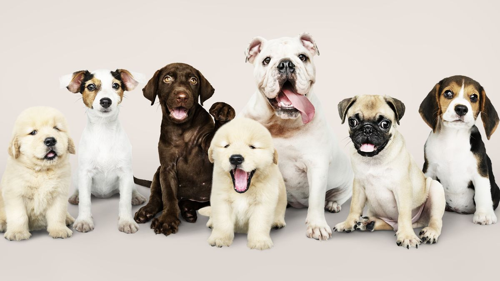

Humans obviously don't share a recent relationship history with dogs and cats. Let's assume science is 100% credible; then dogs and humans share relationships as old as 10000-15000 years. This was when Eagles still hunted humans in the grasslands of Africa. It is not sure whether dogs evolved to be with humans so that they could secure food or humans needed dogs to help them with hunting, so they domesticated them. Whatever the case, humans' relationship with dogs is not just some generational long.

<figure class="wp-block-image size-large is-resized">

</figure>

[With 15,000 years of living together, humans and dogs have developed a genetic intimacy to have affection for each other naturally. But the central question here is what kind of adaptation the human body has developed to these long-standing relationships:]{style="font-size: 14pt;"}

<ol>

<!-- wp:list-item -->

<li>[Protection from autoimmune disease]{style="font-size: 14pt;"}</li>

<!-- /wp:list-item -->

</ol>

[The cows saved the farmers when the whole world was dying during the Cowpox epidemic in the 16th century. But, never had we heard of pets saving humans from an autoimmune disease like asthma. In the book " the gut microbiome' the author says, "pet owners have 25% less chance of getting an autoimmune disease like asthma". Why is this the case? Ans: the basic foundation of our body is the microbiome. The microbiome is billions of diverse bacteria that survive in our bodies. if these bacteria are in a balanced and diverse state, we get the best health both physically and mentally, we get the best digestion, and most importantly, the best mind. So as we touch and get exposed to our pets and farm animals, we regularly come in contact with bacteria that are not in our bodies. That way, our microbiome develops resistance to these new bacteria. This was the reason the cows saved farmers from cowpox. And so is true for dogs and cats. The hostile bacteria in their bodies train our microbiome to be resistant. Such resistance training makes our microbiome physically strong against autoimmune disease.]{style="font-size: 14pt;"}

[2. Improved mental health, even for non-remissive mental disorder]{style="font-size: 14pt;"}

[Walking pets to nearby parks is a great refreshing activity for city people. Several research studies have found that walking pets or playing with pets significantly reduces depression, solace loneliness and facilitates psychotherapy. One fascinating study comes from Periera, 2018 who found that treatment remission disorder has higher remission rates among patients with pets. This makes sense, especially in the 21st century, where humans are the closest to each other in all of history yet are mentally the most distant. The rush for earning and depressive mode that comes from 9-5 jobs have isolated and challenged the mechanism of native body functioning, thus inviting unwanted hormones in the body, increasing cortisol and stress hormones.]{style="font-size: 14pt;"}

[3. Healthy and physically fit children]{style="font-size: 14pt;"}

[The benefits of having pets at home were well documented in 20th-century clinical research. Several studies showed pets' influence in reducing blood pressure in children. Similarly, studies also documented the positive benefits of dogs and cats to aeroallergens and wheezing symptoms in young babies and children. Though the impacts of wheezing are two-sided: both the bad and good side of pets has been documented on this matter, there are robust findings suggesting that children can have improvised symptoms of wheezing over time as they get used to bacteria in pets.]{style="font-size: 14pt;"}

<figure class="wp-block-image size-large is-resized">

</figure>

[4. 3. Longevity and vitality]{style="font-size: 14pt;"}

[This is an indirect benefit humans get from having pets at home. Usually, the one who has pets, mostly dog, often take them for walking. Recent studies on the relationship between humans and pets have some extra findings: pet owners are likely to double their exercise and body movement if they go jogging with pets. Moreover, dog walking also increases exposure to sunlight, which has hundreds of benefits, from vitamin production to eye-sight improvement, which will be described in detail in the link (<a title="" href="https://nativehealingmethods.com/2023/02/04/one-natural-reason-you-should-get-sunlight/">https://nativehealingmethods.com/2023/02/04/one-natural-reason-you-should-get-sunlight/</a>).]{style="font-size: 14pt;"}

[Date: 1/32/2023]{style="font-size: 14pt;"}

