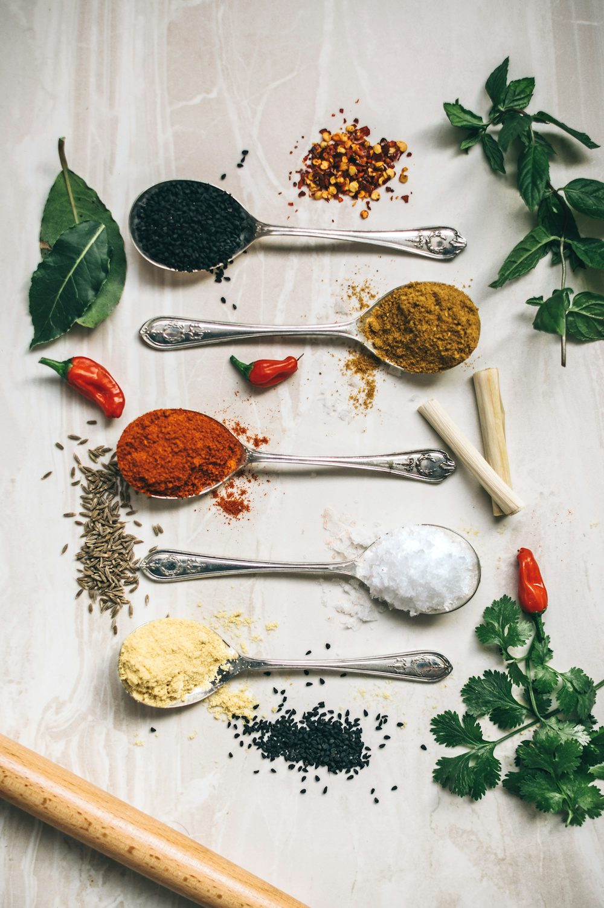
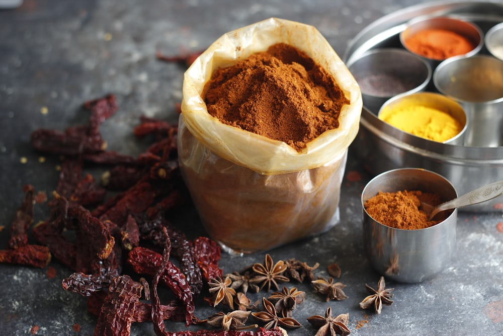
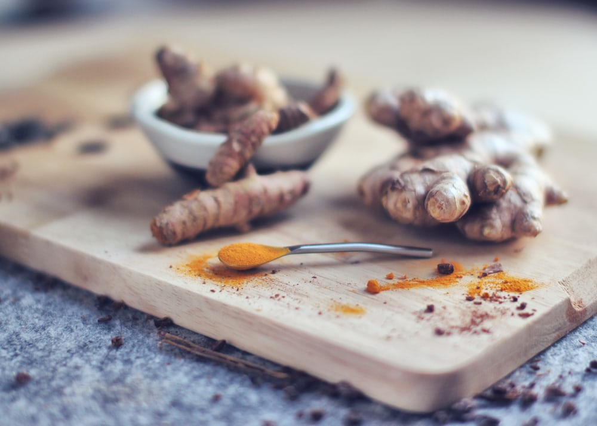
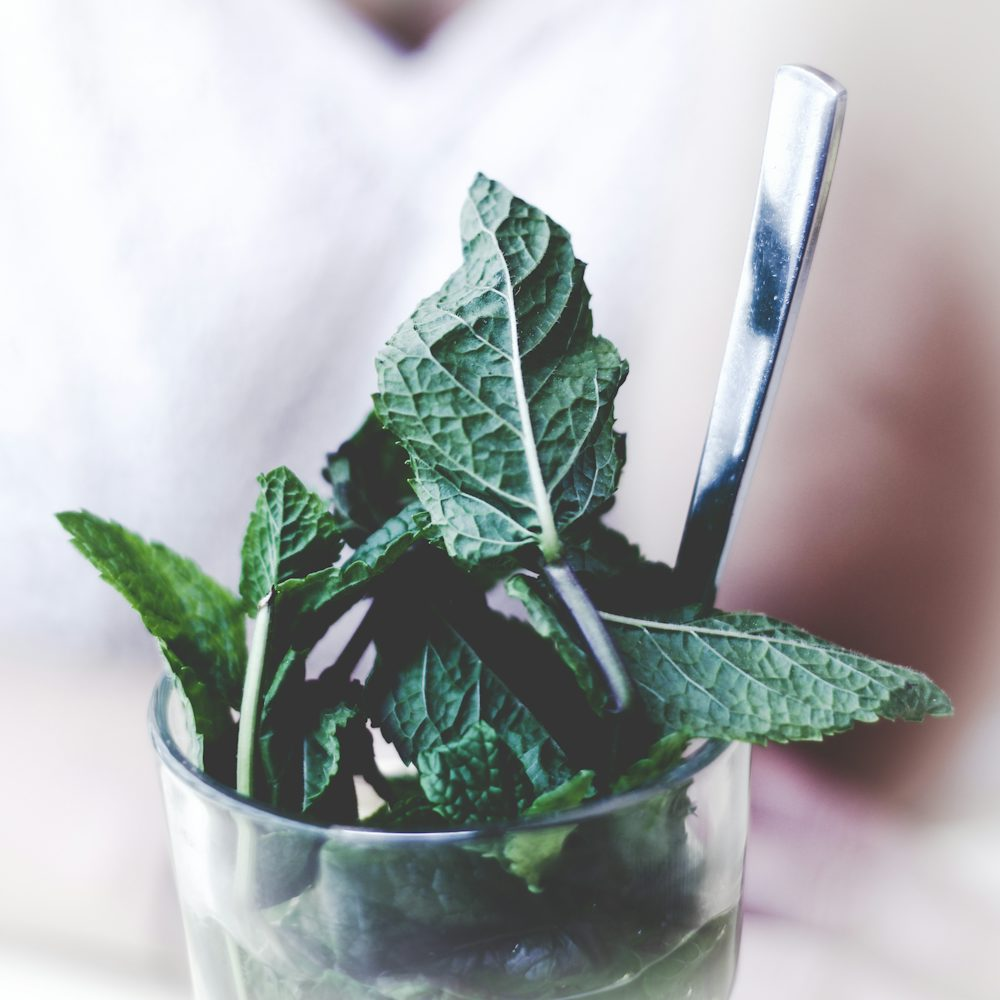

[When I first read a book on Ayurveda medicine(the oldest form of medicine prevalent in India, Nepal, and the Hindu community), I was shocked knowing the natural health benefits of different food seasonings to human gut health. Even the plants that I considered poisonous and not let my goats feed on appeared to have medicinal importance.]{style="font-size: 14pt;"}

[In Hindu culture, it has always remained true that plants around us carry fascinating health importance. Collecting critical medicinal plants like Yarshagumba, Serpaganda, and several other medicinal herbs found across its 800km long Himalayan ranges is an established practice in Nepal. Thousands of locals adventure to the mountains during collection season to harvest these essential herbs.]{style="font-size: 14pt;"}

<figure class="wp-block-image size-large">

</figure>

[But how true is it that daily consumption of such medicinal herbs still carries significant health benefits? Can these herbs possibly lose their power in the human body upon daily consumption? For this question, there does not exist concrete answer. But as per Hindu practice, Brahmins(religious people in Hindu culture) should avoid eating all these seasonings daily or add them as seasoning. Sadhguru, a famous religious personnel in India, adds that consuming these herbs daily does not produce the same effect as taking them occasionally.]{style="font-size: 14pt;"}

[The four seasonings and their importance in human health are mentioned below:]{style="font-size: 14pt;"}

[1. Turmeric: In south Asian countries, turmeric is an essential seasoning in cooking. The earliest date of its use dates back as early as 4000 years before in India, where it was used as a spice. In modern-day, clinical research has authenticated turmeric for diseases, especially cancer, diabetes, and inflammation. In a non-clinical study done in diabetic rats, the use of turmeric showed a significant reduction in their blood sugar level. Besides, turmeric also has anticoagulant properties that improve blood flow through arteries. Turmeric is also well known for its low toxicity and efficacy in reducing inflammation like leg inflammation and edema.]{style="font-size: 14pt;"}

<figure class="wp-block-image size-large">

</figure>

[Ginger: Like Turmeric, the origin of ginger also dates back thousands of years. Along with using it in seasoning, ginger was previously used as a healing strategy in Asia, the middle east, and Europe to cure arthritis, stomach upset, diabetes, and menstrual irregularities. Besides these healing benefits, ginger has many other benefits, which are all explained in detail in the book Natural secrets to healing.]{style="font-size: 14pt;"}

<figure class="wp-block-image size-large">

</figure>

 [Peppermint: The use of peppermint dates back as early as 1700 through Romans, Egypt, and Greeks in healing gut issues.  It is believed that the seasoning relaxes tissues in the gut and improves digestion. For the same reason, Dr. Berg (in his YouTube) and Dr. Will B (in his podcast) mention that it even helps patients with IBS syndrome. IBS syndrome relates to unhealthy and unbalanced gut bacteria (I will discuss his detail in the next blog). Besides natural benefits to digestion, peppermint also improves bad symptoms like bad odor in the mouth, gas, and bloating.]{style="font-size: 14pt;"}

<figure class="wp-block-image size-large">

</figure>

[Capsaicin: Like all previously mentioned seasonings, Capsaicin has fascinating natural benefits if taken in moderate amounts. However, it is essential to note that Capsaicin is not always suitable for everyone. In Ayurveda, people with issues with the lower abdomen (like IBS, Crohn’s, or any other forms of colon inflammation) are strictly restricted from taking Capsaicin. For healthy people, Capsaicin has positive impacts like natural fat burning, improved digestion due to muscle relaxation (as induced by peppermint), improved heart health, and reduces abdominal and colon cancer.]{style="font-size: 14pt;"}

<figure class="wp-block-image size-large">

</figure>
